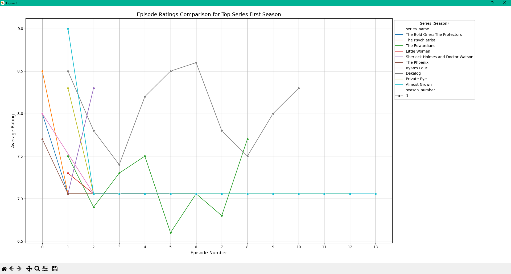

# Episode Rating Performance Analysis [episode_rating_performance.py](../data_analysis/scripts/episode_rating_performance.py)

This section explores how episode ratings vary across the top-rated series, providing a comparative visualization to understand trends and viewer preferences. The analysis is flexible, allowing customization of the number of series to compare.

## Code Overview

The script retrieves and processes episode data from the database, focusing on top series by average rating. It then generates a combined graph comparing the episode performance of these series. Key tools include:

- **Pandas**: For handling inconsistent or missing data, ensuring a clean dataset.
- **Matplotlib**: For visualizing episode ratings in a clear, color-coded graph.

## Usage Instructions

To run the script:

```bash
python episode_rating_performance.py [n]
```

- `n` (optional): The number of top series to analyze (default is 10).
- Ensure the database is active, with the environment variables correctly configured for access.

## Insights and Output

The graph provides a side-by-side comparison of episode ratings for the selected series:

- **X-axis**: Episode numbers (uniformly scaled for clarity).
- **Y-axis**: Average episode ratings.
- Each series is assigned a unique color and labeled for identification.

This visualization reveals trends such as consistent performance, standout episodes, or notable drops, reflecting series quality and viewer engagement.



---

# Actor Rating Performance Analysis [actor_rating_performance.py](../data_analysis/scripts/actor_rating_performance.py)

This section analyzes actor performance based on the number of high-rated movies they've been part of, focusing on actors in the top 5 cast positions of movies with ratings above a specified threshold. The analysis visualizes actor performance with a histogram, offering insights into actors with the most movies above the threshold.

The script is flexible and allows customization of the number of top actors to analyze and the rating threshold for high-rated movies.

## Code Overview

The script fetches actor data from a database, focusing on actors in the top cast positions of movies with ratings above a specified threshold. It then generates a histogram to visualize the performance of these actors. Key tools include:

- **Pandas**: For retrieving and processing data from the database, and handling inconsistencies.
- **Matplotlib**: For generating a histogram to represent the number of high-rated movies for each actor.
- **SQLAlchemy**: For database interaction to fetch actor data.

### Key Functions

- `fetch_actor_data(engine, top_n, rating_threshold)`: Retrieves data on the top `n` actors with the most movies rated above the `rating_threshold`.
- `plot_actor_data(actor_data, top_n, rating_threshold)`: Generates a histogram visualizing the number of high-rated movies for the top `n` actors.

## Usage Instructions

To run the script:

```bash
python actor_rating_performance.py [n] [rating_threshold]
```

- `n` (optional): The number of top actors to analyze (default is 10).
- `rating_threshold` (optional): The minimum rating for movies to be considered high-rated (default is 7.5).
- Ensure the database is active and that the environment variables are correctly configured for access.

### Example

```bash
python actor_rating_performance.py 20 8
```

This command analyzes the top 20 actors who have been in movies with a rating greater than 8.

## Script Details

- **Database Connection**: The script connects to a PostgreSQL database (IMDB), using SQLAlchemy for seamless interaction.
- **Data Query**: The script executes an SQL query to select actors from the top 5 cast positions in movies with ratings above the threshold.
- **Data Handling**: The script handles potential null values by filling them with zeros and ensures the data is clean before proceeding to visualization.
- **Visualization**: A histogram is created using Matplotlib, showing the number of high-rated movies for each actor.

## Insights and Output

The output consists of two parts:

1. **Actor Data Output**: A list of the top actors along with the number of high-rated movies they have. Example output:

    ```yaml
    Top Actors and Their High-Rated Movie Counts:
    1. Actor Name: 15 movies
    2. Actor Name: 12 movies
    3. Actor Name: 10 movies
    ```

2. **Histogram**: A bar chart displaying the number of high-rated movies for each actor. The x-axis shows actor names, while the y-axis represents the number of movies with ratings above the specified threshold.


This analysis can be used to evaluate actor performance in top-rated movies, providing a clear picture of which actors are repeatedly part of successful films.

---

# Genre Popularity Over Decades [genre_popularity.py](../data_analysis/scripts/most_popular_genre_overtime.py)

This section analyzes the popularity of different movie genres over the decades, providing insights into how genre preferences have evolved over time. The analysis generates a stacked bar chart to visually compare the number of movies per genre per decade, and it prints the exact genre counts to the console for further examination.

## Code Overview

The script retrieves genre data from the database, filters it for movies only, and processes it to count the number of movies per genre per decade. It then generates a stacked bar chart to visualize the popularity of each genre over time. Key tools include:

- **Pandas**: For organizing the data and transforming it into a format suitable for plotting.
- **Matplotlib**: For generating the stacked bar chart.
- **SQLAlchemy**: For querying the database and retrieving the genre data.

### Key Functions

- `fetch_genre_popularity(engine)`: Retrieves data on movie genres per decade, filtering for movies only.
- `plot_genre_popularity(genre_data)`: Generates a stacked bar chart visualizing the genre popularity over decades and prints the exact counts for each genre.

## Usage Instructions

To run the script:

```bash
python most_popular_genre_overtime.py
```

- Ensure the database is active and that the environment variables are correctly configured for access.

## Script Details

- **Database Connection**: The script connects to a PostgreSQL database (IMDB) using SQLAlchemy.
- **Data Query**: The script executes an SQL query to select movie genres per decade, filtering by the title type.
- **Data Handling**: The script processes the data to count movies per genre per decade, fills any missing values with zeros, and prepares the data for visualization.
- **Visualization**: A stacked bar chart is generated using Matplotlib, showing the number of movies per genre per decade. The genre counts are also printed to the console.

## Insights and Output

The output consists of two parts:

1. **Exact Counts Output**: The script prints the exact number of movies per genre per decade to the console. Example output:

    ```yaml
    Genre Popularity Over Decades (Exact Counts):

    Decade: 1980s
      Action: 120 movies
      Drama: 95 movies
      Comedy: 80 movies

    Decade: 1990s
      Drama: 150 movies
      Comedy: 130 movies
    ```

2. **Stacked Bar Chart**: A bar chart showing the number of movies per genre per decade. The x-axis represents the decades, and the y-axis represents the number of movies. Each genre is represented by a different color in the stacked bars.


This analysis helps identify trends in genre popularity over time, allowing insights into which genres have gained or lost popularity in each decade.