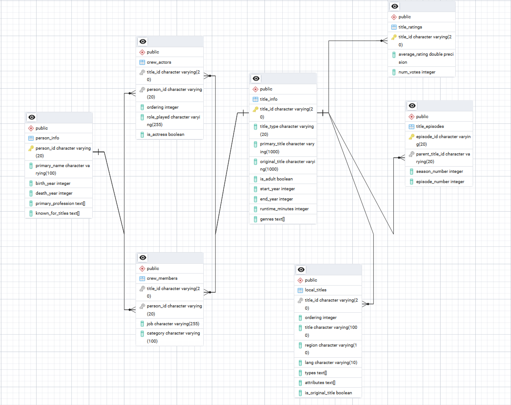

# Database Structure
As shown in the ER diagram below, our representation of the IMDB dataset consists of 7 tables:
- `title_info`: contains the basic information about each title, such as the title type, primary title, original title, is_adult, start year, end year, runtime, and genres. The table uses title_id as the primary key.

- `person_info`: contains the basic information about each person, such as their name, birth year, death year, primary profession, and known for titles. The table uses person_id as the primary key.

- `title_episodes`: contains the information about each episode, including the parent title ID, season number, episode number. The table uses episode_id as the primary key with parent_title_id referencing the title_info table.

- `title_ratings`: contains the average rating and number of votes for each title. The table uses title_id as the primary key.

- `local_titles`: contains the localized titles for each title, including the title_id, region, and title. This table has no primary key, with title_id being a foreign key referencing the title_info table.

- `crew_members`: As opposed to the original dataset's principals and crew tables, we store all non-actor crew members in a single table with the title_id, person_id, job details, and category of their role (e.g., writer, director).

- `crew_actor`: Originally, the principals table contained both actors and non-actor crew members. We split this table into two separate tables, with the `crew_actor` table containing the title_id, person_id, ordering, is_actress, and the character name of the actor's role.

## Indexes
To optimize query performance, we have created indexes on the following columns:

### title_info:
  - `title_id` (primary key)
  - `title_type`
  - `start_year`
  - `original_title`

### local_titles:
  - `title_id`
  - `region, lang`

### title_ratings:
  - `average_rating`
  - `num_votes`

### person_info:
  - `person_id` (primary key)
  - `primary_name`

### crew_actors:
  - `title_id`
  - `person_id`
  - `title_id, ordering`

### crew_members:
  - `title_id`
  - `person_id`
  - `title_id, category`

### title_episodes:
  - `episode_id` (primary key)
  - `parent_title_id`
  - `season_number`
